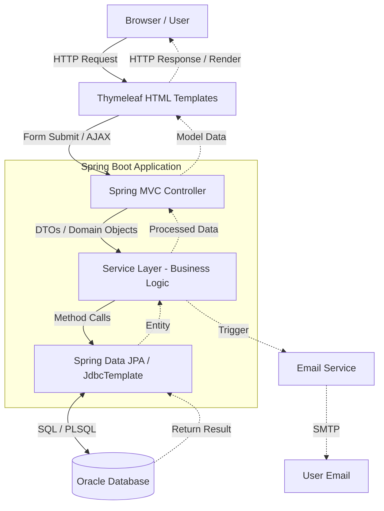

# Application Architecture Diagram

The RevPay application is designed using a **Monolithic MVC (Model-View-Controller) Architecture**. 

This structure ensures a clear separation of concerns between user interfaces, request handling, business logic, and data access.

## System Layers

### 1. Presentation Layer (View)
The presentation layer is responsible for rendering the user interface and communicating with the backend controllers via HTTP requests.
*   **Technology:** Thymeleaf Templates, HTML5, CSS3, JavaScript (Vanilla, Chart.js)
*   **Responsibilities:** Rendering dynamic views, capturing user input, basic client-side validation, and displaying dynamic data (like charts and alerts).

### 2. Controller Layer
The controller layer intercepts incoming HTTP requests from the browser, extracts parameters, and delegates work to the Service Layer.
*   **Technology:** Spring MVC (`@Controller`, `@RestController`)
*   **Examples:**
    *   `UserController` (Registration, Login, Profile)
    *   `WalletController` (Adding funds, Card linking)
    *   `TransactionController` (Sending/Requesting money)
    *   `InvoiceController` (Business billing)
    *   `LoanController` (EMI calculation, Loan applications)
    *   `AnalyticsController` (Dashboard graphing data)

### 3. Service Layer
The service layer contains the core business logic of the application. It enforces rules, orchestrates operations across multiple repositories, and manages external integrations (like sending emails).
*   **Technology:** Spring Service Beans (`@Service`)
*   **Examples:**
    *   `UserService` (User management, OTP generation, 2FA)
    *   `WalletService` (Balance management, Encryption algorithms)
    *   `TransactionService` (P2P transfers, PIN verification)
    *   `InvoiceService` (Invoice state machines, PDF generation)
    *   `LoanService` (Loan approval flows)
    *   `NotificationService` (System alerting, Email delegation)

### 4. Repository Layer
The repository layer handles all database interactions. It translates Java object operations into SQL queries.
*   **Technology:** Spring Data JPA (`@Repository`), JdbcTemplate
*   **Examples:**
    *   `UserRepository`
    *   `WalletRepository`
    *   `TransactionRepository`
    *   *(Note: The system also heavily utilizes `JdbcTemplate` for complex reporting queries and calling Oracle PL/SQL Stored Procedures).*

### 5. Database Layer
The data persistence tier.
*   **Technology:** Oracle Database (12c+)
*   **Tables:** `Users`, `Wallet`, `Cards`, `Translations`, `Loans`, `Invoices`, etc.
*   **Logic:** Includes robust PL/SQL Stored Procedures (e.g., `transfer_money`, `calculate_emi`) to ensure atomicity and data integrity at the database level.

---

## Request Flow Diagram

