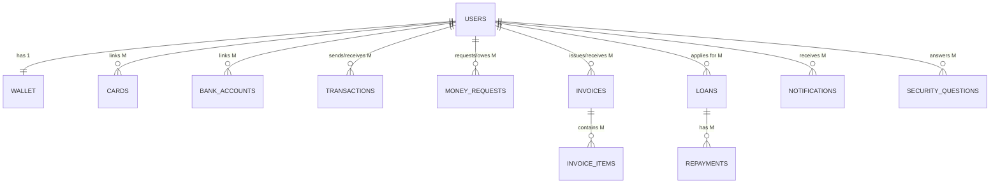

# Entity Relationship Diagram (ERD)

This document outlines the database schema and entity relationships for the RevPay application.

## Entities

The RevPay database consists of the following primary entities:

1.  **Users:** Stores user profiles, authentication credentials, and preferences.
2.  **Wallet:** Stores user's current platform balance.
3.  **Cards:** Stores encrypted credit/debit card details linked to users.
4.  **BankAccounts:** Stores encrypted bank account details linked to users.
5.  **Transactions:** Records all money transfers, deposits, and withdrawals.
6.  **MoneyRequests:** Tracks peer-to-peer payment requests.
7.  **Invoices:** Records business billing documents requested from customers.
8.  **InvoiceItems:** Stores the specific line items (products/services) for a given invoice.
9.  **Loans:** Tracks user loan applications, terms, and repayment status.
10. **Repayments:** Records individual payments made towards an active loan.
11. **Notifications:** Stores system and user-to-user alerts.
12. **NotificationPreferences:** Tracks user opt-in/opt-out settings for different alert types.
13. **SecurityQuestions:** Stores 2FA verification questions and hashed answers.

## Key Relationships

Below are the foundational relationships defining the data structure:

*   **User → Wallet (1:1):** Every user has exactly one digital wallet.
    *   *Foreign Key:* `Wallet.user_id` references `Users.id`
*   **User → Cards (1:M):** A user can link multiple debit/credit cards.
    *   *Foreign Key:* `Cards.user_id` references `Users.id`
*   **User → BankAccounts (1:M):** A user can link multiple bank accounts.
    *   *Foreign Key:* `BankAccounts.user_id` references `Users.id`
*   **User → Transactions (1:M):** A user can participate in multiple transactions (as sender or receiver).
    *   *Foreign Keys:* `Transactions.sender_id` and `Transactions.receiver_id` reference `Users.id`
*   **User → MoneyRequests (1:M):** A user can send or receive multiple payment requests.
    *   *Foreign Keys:* `MoneyRequests.requester_id` and `MoneyRequests.requestee_id` reference `Users.id`
*   **BusinessUser → Invoices (1:M):** A business user can issue multiple invoices.
    *   *Foreign Key:* `Invoices.business_id` references `Users.id` (where role is Business)
*   **Invoice → InvoiceItems (1:M):** An invoice can contain multiple line items.
    *   *Foreign Key:* `InvoiceItems.invoice_id` references `Invoices.id`
*   **User → Loans (1:M):** A user can apply for multiple loans.
    *   *Foreign Key:* `Loans.user_id` references `Users.id`
*   **Loan → Repayments (1:M):** A loan is paid back via multiple repayment transactions.
    *   *Foreign Key:* `Repayments.loan_id` references `Loans.id`
*   **User → Notifications (1:M):** A user can receive multiple system notifications.
    *   *Foreign Key:* `Notifications.user_id` references `Users.id`
*   **SecurityQuestions → Users (1:M):** A user can have multiple security questions configured for account recovery.
    *   *Foreign Key:* `SecurityQuestions.user_id` references `Users.id`

## Mermaid Diagram

